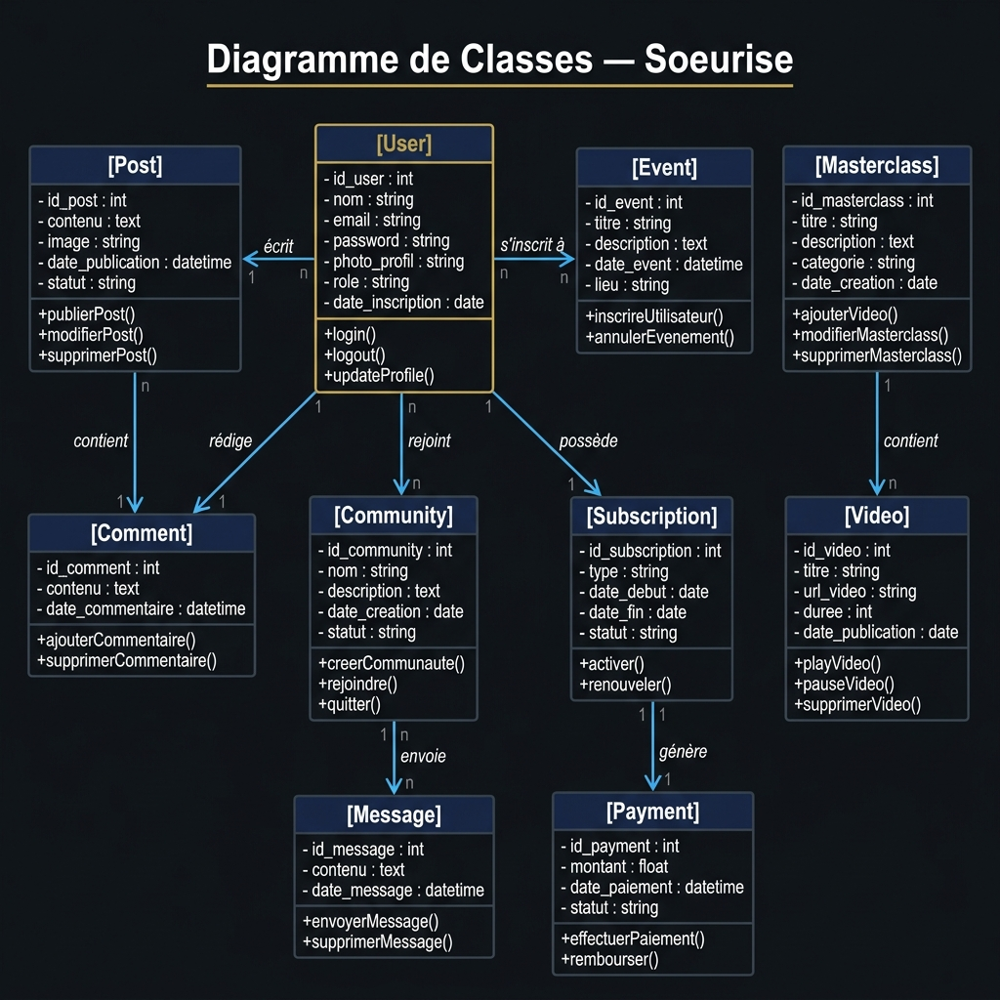
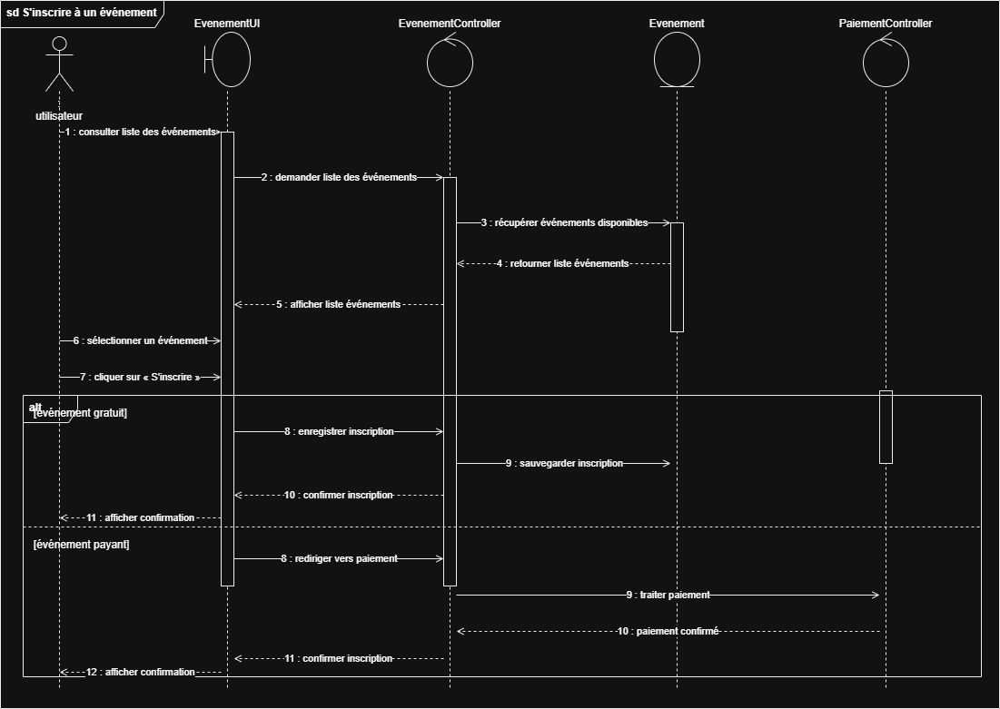
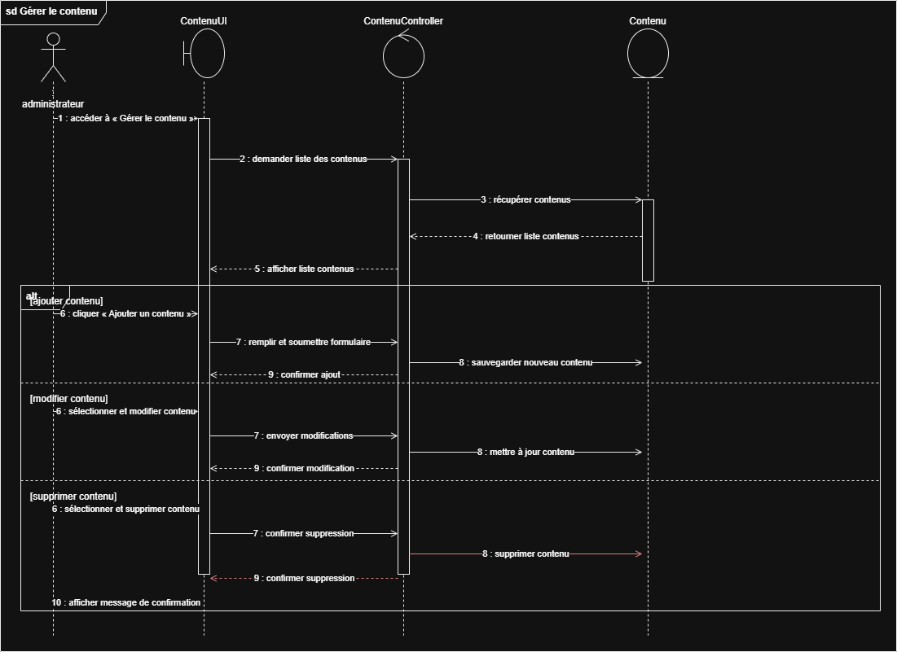

    
  

    République Tunisienne 
    Ministère de l'Enseignement Supérieur et de la Recherche Scientifique 
    <b>ÉCOLE SUPÉRIEURE PRIVÉE DE TECHNOLOGIES DE L'INFORMATION ET DE GESTION DE NABEUL</b>
  

    
   
     
  
  <h1 style="font-family: Arial, sans-serif; font-size: 28px; font-weight: bold; color: #1B2A4A;">
    Rapport sur le Projet de Fin d'Études
  </h1>
  <h2 style="font-family: Arial, sans-serif; font-size: 22px; color: #333;">
    Conception et Développement de la Plateforme Communautaire "Soeurise" avec Analyse Prédictive du Churn
  </h2>
  
     
  
<i>Spécialisation : 2BIA / Ingénierie Logicielle</i>

     

  <table width="100%" style="font-size: 18px; border: none;">
    <tr style="border: none;">
      <td align="center" width="50%" style="border: none;">
        <b>Préparé par :</b> 
        Hamza Aouinti
      </td>
      <td align="center" width="50%" style="border: none;">
        <b>Supervisé par :</b> 
        Mme. Safa Fennia
      </td>
    </tr>
  </table>

       
  
Année académique 2024-2025

# Dédicaces

Je dédie ce travail à mes parents, pour leurs sacrifices, leur amour inconditionnel et leur soutien constant tout au long de mes études. Leur confiance en moi a été ma plus grande source de motivation.

À ma famille et mes amis, qui ont toujours été présents pour m'encourager et me conseiller dans les moments de doute.

À tous ceux qui ont cru en moi et m'ont soutenu de près ou de loin dans la réalisation de ce projet.

# Remerciements

Je tiens tout d'abord à exprimer ma profonde gratitude envers mon encadrante, **Madame Safa Fennia**, pour son encadrement rigoureux, ses précieux conseils et sa disponibilité tout au long de ce projet de fin d'études. Ses directives éclairées ont grandement contribué à l'aboutissement de ce travail.

Mes remerciements s'adressent également au corps professoral et administratif de **l'École Supérieure Privée de Technologies de l'Information et de Gestion de Nabeul (ITBS)** pour la qualité de l'enseignement que j'ai reçu durant mon cursus universitaire.

Enfin, je remercie sincèrement les membres du jury d'avoir accepté d'évaluer ce travail et d'y apporter leurs critiques constructives.

# Table des Matières

1. [Introduction Générale](#introduction-générale)
2. [Chapitre 1 : Contexte et Cadre Général du Projet](#chapitre-1--contexte-et-cadre-général-du-projet)
3. [Chapitre 2 : Spécification et Analyse des Besoins](#chapitre-2--spécification-et-analyse-des-besoins)
4. [Chapitre 3 : Conception du Système](#chapitre-3--conception-du-système)
5. [Chapitre 4 : Réalisation et Implémentation](#chapitre-4--réalisation-et-implémentation)
6. [Conclusion Générale et Perspectives](#conclusion-générale-et-perspectives)

# Introduction Générale

À l'ère de la transformation numérique, les plateformes sociales et communautaires jouent un rôle central dans notre quotidien. Cependant, face à la multiplicité des réseaux existants, il devient essentiel de proposer des espaces dédiés, sécurisés et adaptés à des publics spécifiques. C'est dans ce contexte que s'inscrit le projet **Soeurise**, une application mobile communautaire conçue pour répondre aux besoins d'échange, d'apprentissage et de partage.

Outre le défi de créer une plateforme robuste et ergonomique, l'un des enjeux majeurs des applications modernes réside dans la fidélisation des utilisateurs. La perte d'utilisateurs, communément appelée "Churn", représente un coût important. C'est pourquoi ce projet intègre non seulement le développement d'une architecture logicielle moderne (Frontend mobile, Backend API), mais également l'intégration d'un pipeline de **Business Intelligence (BI) et de Machine Learning** visant à analyser le comportement des utilisateurs et à prédire le taux de désabonnement.

Ce rapport détaille les différentes phases du cycle de vie du développement de ce projet, de l'analyse des besoins à la conception architecturale, jusqu'à l'implémentation technique et le déploiement des modèles prédictifs.

# Chapitre 1 : Contexte et Cadre Général du Projet

## 1.1 Présentation du Projet
Le projet "Soeurise" consiste en la conception et le développement d'une plateforme communautaire mobile. L'application permet aux utilisateurs de créer des profils, de rejoindre des communautés, de publier du contenu interactif, et de s'inscrire à des événements ou des masterclasses.

## 1.2 Problématique
Les plateformes communautaires font face à deux problématiques majeures :
1. **L'engagement utilisateur :** Comment fournir une expérience fluide et centralisée qui regroupe à la fois les aspects sociaux (posts, commentaires) et l'apprentissage (masterclasses, événements) ?
2. **La rétention (Churn) :** Comment identifier de manière proactive les utilisateurs susceptibles de quitter la plateforme afin de mettre en place des actions de fidélisation ciblées ?

## 1.3 Objectifs du Projet
Pour répondre à ces problématiques, les objectifs suivants ont été définis :
* Développer une application mobile cross-platform performante et ergonomique.
* Mettre en place une API backend robuste et sécurisée.
* Implémenter un algorithme d'apprentissage automatique (Machine Learning) pour prédire le risque de churn des utilisateurs.
* Construire un tableau de bord analytique (Dashboard) permettant aux administrateurs de suivre les KPIs de la plateforme en temps réel.

## 1.4 Méthodologie Adoptée
Pour mener à bien ce projet, nous avons opté pour la méthodologie agile **Scrum**. Cette approche itérative et incrémentale nous a permis de livrer des fonctionnalités de manière continue, tout en restant flexibles face aux changements des exigences. Le projet a été divisé en plusieurs *Sprints* couvrant l'analyse, le maquettage, le développement backend, le développement mobile et l'intégration de la solution Data/ML.

# Chapitre 2 : Spécification et Analyse des Besoins

Dans ce chapitre, nous définissons les acteurs interagissant avec le système et détaillons les exigences fonctionnelles et non-fonctionnelles.

## 2.1 Identification des Acteurs
Nous avons identifié quatre acteurs principaux interagissant avec le système "Soeurise" :
1. **Le Visiteur :** Un utilisateur non authentifié qui peut consulter les pages publiques (créer un compte, consulter le catalogue des masterclasses publiques).
2. **Le Membre (Utilisateur) :** Un utilisateur inscrit qui peut interagir avec la communauté, publier des posts, gérer son profil, s'inscrire à des événements et consulter du contenu exclusif.
3. **L'Administrateur :** Un utilisateur privilégié responsable de la gestion de la plateforme (gestion du contenu, modération des utilisateurs, consultation des statistiques).
4. **La Passerelle de Paiement :** Un acteur système externe intervenant pour traiter les paiements liés aux abonnements premium et aux masterclasses payantes.

## 2.2 Diagramme de Cas d'Utilisation Global
Le diagramme suivant illustre les fonctionnalités offertes par le système en fonction des rôles des acteurs.

.png)

### Description des cas d'utilisation majeurs :
* **S'authentifier :** Processus central (inclusion) requis pour toutes les actions sécurisées du membre et de l'administrateur.
* **Gérer son profil :** Permet au membre de modifier ses informations personnelles et de gérer son abonnement (avec extension vers la passerelle de paiement).
* **Publier un post / Participer aux discussions :** Fonctionnalités sociales de base pour l'interaction communautaire.
* **Gérer le contenu et les événements :** Fonctionnalité exclusive à l'administrateur pour ajouter, modifier ou supprimer des entités sur la plateforme.

## 2.3 Exigences Non-Fonctionnelles
* **Sécurité :** Les mots de passe doivent être hachés. L'authentification doit utiliser des tokens sécurisés (JWT).
* **Performance :** Le backend doit pouvoir supporter de multiples requêtes simultanées sans dégradation notable du temps de réponse.
* **Ergonomie :** L'interface utilisateur mobile doit être intuitive, moderne et responsive.

# Chapitre 3 : Conception du Système

Ce chapitre présente les choix d'architecture logicielle et la conception détaillée (statique et dynamique) de l'application.

## 3.1 Conception Statique : Diagramme de Classes
Afin de modéliser la structure de la base de données et les relations entre les différentes entités du domaine métier, nous avons élaboré le diagramme de classes suivant.

Ce diagramme met en évidence les relations essentielles :
* L'entité **User** est au cœur du système : elle rédige des **Comments**, écrit des **Posts**, rejoint des **Communities** et s'inscrit à des **Events**.
* Un mécanisme de **Subscription** génère des **Payments** via la passerelle.
* Les **Masterclasses** contiennent des **Videos**.

## 3.2 Conception Dynamique : Diagrammes de Séquence
Les diagrammes de séquence modélisent les interactions chronologiques entre les différents objets du système lors de l'exécution d'un cas d'utilisation.

### 3.2.1 Séquence : S'inscrire à un événement
Ce scénario décrit comment un membre consulte et s'inscrit à un événement, avec un traitement conditionnel selon si l'événement est gratuit ou payant.

**Déroulement :**
1. Le contrôleur récupère la liste des événements disponibles.
2. L'utilisateur sélectionne un événement et initie l'inscription.
3. Si l'événement est gratuit, l'inscription est sauvegardée directement.
4. Si l'événement est payant, l'utilisateur est redirigé vers le `PaiementController` pour traiter la transaction avant validation.

### 3.2.2 Séquence : Gérer le Contenu (Administrateur)
Ce scénario illustre le processus de création, modification ou suppression d'un contenu (post, événement, masterclass) par l'administrateur.

**Déroulement :**
1. L'administrateur accède à l'interface de gestion de contenu.
2. Il a le choix (bloc "alt") entre Ajouter, Modifier ou Supprimer un contenu.
3. Les données sont validées par le `ContenuController` puis persévérées ou mises à jour au niveau du modèle métier `Contenu`.

# Chapitre 4 : Réalisation et Implémentation

Dans ce chapitre final, nous présentons les outils technologiques utilisés pour le développement ainsi que les résultats obtenus.

## 4.1 Outils et Technologies
Pour garantir la scalabilité et la performance de "Soeurise", nous avons opté pour les technologies suivantes :
* **Frontend Mobile :** Développé avec **Flutter** (Dart), permettant d'exporter des applications natives iOS et Android avec un seul code source.
* **Backend API :** Développé en **Node.js** avec le framework Express.js.
* **Base de Données :** **MongoDB** (via Mongoose), une base NoSQL adaptée à la flexibilité des documents JSON (Posts, Profils).
* **Machine Learning :** Python, **Scikit-Learn** pour l'entraînement du modèle Random Forest destiné à la prédiction du Churn.
* **Analytique & BI :** La suite **ELK (Elasticsearch, Logstash, Kibana)** pour ingérer les logs de l'application et visualiser les KPIs sur des dashboards dynamiques en temps réel.

## 4.2 Implémentation du Pipeline de Prédiction (Churn)
L'une des innovations du projet est l'implémentation d'un algorithme de Machine Learning. 
Nous avons utilisé l'algorithme **Random Forest** (Forêt Aléatoire) car il gère très bien les données non-linéaires et indique l'importance des variables (features).
* **Features utilisées :** Fréquence de connexion, nombre de posts publiés, participations aux événements, jours depuis la dernière activité.
* Les données prédictives sont ensuite envoyées vers Elasticsearch pour être affichées à l'administrateur.

## 4.3 Interfaces de l'Application et Dashboards
*(Note pour l'impression : Insérer ici les captures d'écran de l'application mobile finale et du dashboard Kibana).*

L'application mobile offre une interface épurée avec un mode sombre optimisé. Le tableau de bord administrateur (Kibana) permet de visualiser instantanément le taux de rétention global, la répartition des utilisateurs par communauté, et l'évolution du risque d'abandon (Churn).

# Conclusion Générale et Perspectives

Le projet **Soeurise** nous a permis de concevoir et de développer de bout en bout une plateforme communautaire complète. De la spécification des besoins à la modélisation UML, jusqu'à l'implémentation d'une architecture multi-technologies complexe associant développement mobile, backend cloud et intelligence artificielle.

Ce travail a été une opportunité enrichissante de mettre en pratique nos connaissances en ingénierie logicielle et en analyse de données (Data Science). L'intégration d'un pipeline de prédiction de churn offre une véritable valeur ajoutée métier, transformant une simple application sociale en un outil proactif et intelligent.

**Perspectives d'évolution :**
À l'avenir, le projet "Soeurise" pourrait être enrichi par l'intégration de nouvelles fonctionnalités telles que :
1. L'ajout d'un système de recommandation basé sur le filtrage collaboratif pour suggérer des événements pertinents aux membres.
2. L'intégration de fonctionnalités de visioconférence natives pour les Masterclasses.
3. L'amélioration du modèle prédictif en utilisant des réseaux de neurones profonds (Deep Learning) nourris par une plus grande quantité de données temporelles.
