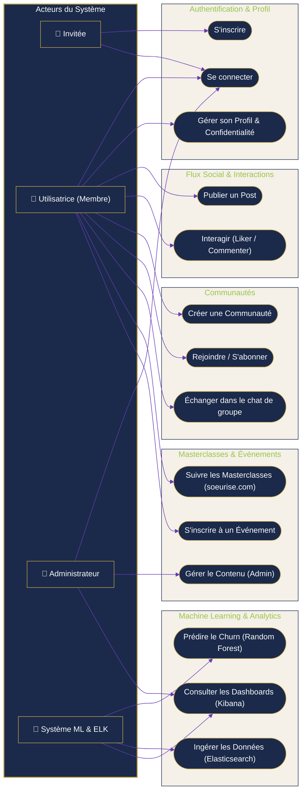
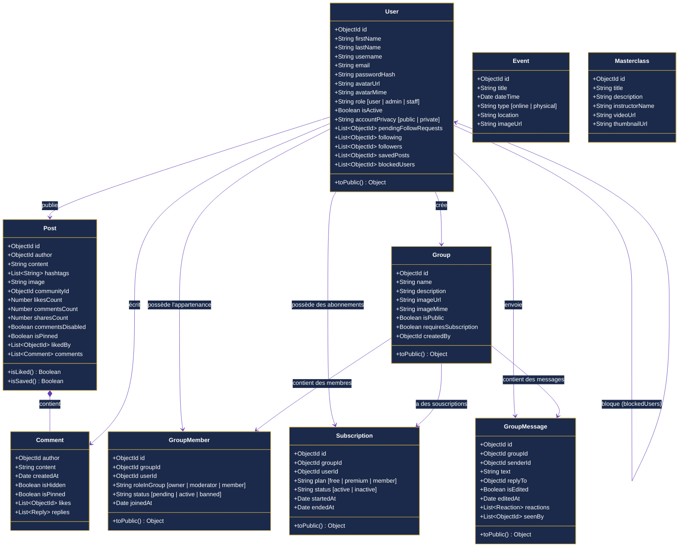

# 📊 Soeurise — Spécifications & Diagrammes UML

Ce document regroupe les diagrammes UML modélisant la plateforme **Soeurise** (Application mobile + Backend + Machine Learning). Les diagrammes sont présentés sous forme d'**images visuelles directes** et accompagnés de leur code source en **Mermaid** pour toute modification future.

---

## 1. 👤 Diagramme de Cas d'Utilisation (Use Case)

Ce diagramme décrit les interactions des différents acteurs avec les modules de l'application :
1. **Invitée** (Visiteuse non connectée)
2. **Utilisatrice** (Membre connectée)
3. **Administrateur** (Gestionnaire de la plateforme)
4. **Système ML / ELK** (Analyse de rétention et prédiction du churn)

### 🖼️ Rendu Visuel
.png)

<details>
<summary>💻 Voir le code source Mermaid (Modifiable)</summary>


</details>

---

## 🔍 Rafinements des Cas d'Utilisation Spécifiques

Voici les détails de raffinement pour les actions principales de l'utilisatrice et de l'administrateur.

### A. Publier un Post


### B. S'inscrire à un Événement


### C. Gérer le Contenu (Administrateur)


---

## 2. 🗂️ Diagramme de Classes (Class Diagram)

Ce diagramme représente la structure statique du backend de **Soeurise**, basé sur les modèles **Mongoose / MongoDB** identifiés dans le code de l'API.

### 🖼️ Rendu Visuel


<details>
<summary>💻 Voir le code source Mermaid (Modifiable)</summary>


</details>

---

## 3. 🔄 Diagrammes de Séquence (Sequence Diagrams)

Voici les scénarios d'interaction clés représentés en diagrammes de séquence dynamiques.

### A. S'authentifier (Connexion)
*Illustre les vérifications de sécurité, le hachage et le retour du token JWT.*

```mermaid
%%{init: {'theme': 'base', 'themeVariables': { 'actorBkg': '#1B2A4A', 'actorBorder': '#C9A84C', 'actorTextColor': '#ffffff', 'signalColor': '#673AB7', 'signalTextColor': '#1B2A4A', 'labelBoxBorderColor': '#C9A84C', 'labelBoxBkgColor': '#F5F0E8', 'labelTextColor': '#1B2A4A'}}}%%
sequenceDiagram
    autonumber
    actor Membre as 👩 Membre
    participant App as 📱 Interface (Flutter)
    participant Server as 🔧 API (Node.js)
    database DB as 💾 Base de données (MongoDB)

    Membre->>App: Saisit l'e-mail et le mot de passe
    App->>Server: Requête POST /api/auth/login
    activate Server
    Server->>DB: Recherche l'utilisateur (User.findOne({ email }))
    activate DB
    DB-->>Server: Retourne le profil utilisateur (passwordHash)
    deactivate DB
    
    Note over Server: Vérification du mot de passe avec bcrypt.compare()
    
    alt Identifiants valides
        Note over Server: Génération du JWT Token
        Server-->>App: Code 200 OK + JWT Token + Profil Public
        App->>App: Stockage du token dans shared_preferences
        App-->>Membre: Redirection vers l'Écran d'Accueil
    else Identifiants invalides
        Server-->>App: Code 401 Unauthorized (Erreur de connexion)
        deactivate Server
        App-->>Membre: Affiche "Email ou mot de passe incorrect"
    end
```

### B. S'inscrire à un Événement
### 🖼️ Rendu Visuel


<details>
<summary>💻 Voir le code source Mermaid (Modifiable)</summary>

```mermaid
%%{init: {'theme': 'base', 'themeVariables': { 'actorBkg': '#1B2A4A', 'actorBorder': '#C9A84C', 'actorTextColor': '#ffffff', 'signalColor': '#673AB7', 'signalTextColor': '#1B2A4A', 'labelBoxBorderColor': '#C9A84C', 'labelBoxBkgColor': '#F5F0E8', 'labelTextColor': '#1B2A4A'}}}%%
sequenceDiagram
    autonumber
    actor Membre as 👩 Membre
    participant App as 📱 Application
    participant Server as 🔧 API Node.js
    database DB as 💾 MongoDB

    Membre->>App: Accède à l'onglet "Événements"
    App->>Server: Requête GET /api/events (avec JWT Header)
    activate Server
    Server->>DB: Récupère la liste des événements
    activate DB
    DB-->>Server: Retourne les documents événements
    deactivate DB
    Server-->>App: Code 200 OK + Liste des Événements
    deactivate Server
    App-->>Membre: Affiche les cartes d'événements
    
    Membre->>App: Clique sur le bouton "S'inscrire"
    App->>Server: Requête POST /api/events/:id/register (JWT)
    activate Server
    Server->>DB: Enregistre la participation
    activate DB
    DB-->>Server: Confirmation d'enregistrement
    deactivate DB
    Server-->>App: Code 201 Created (Inscription validée)
    deactivate Server
    App-->>Membre: Affiche un message de succès & Envoie confirmation
```
</details>

### C. Gérer le Contenu (Administrateur)
### 🖼️ Rendu Visuel


<details>
<summary>💻 Voir le code source Mermaid (Modifiable)</summary>

```mermaid
%%{init: {'theme': 'base', 'themeVariables': { 'actorBkg': '#1B2A4A', 'actorBorder': '#C9A84C', 'actorTextColor': '#ffffff', 'signalColor': '#673AB7', 'signalTextColor': '#1B2A4A', 'labelBoxBorderColor': '#C9A84C', 'labelBoxBkgColor': '#F5F0E8', 'labelTextColor': '#1B2A4A'}}}%%
sequenceDiagram
    autonumber
    actor Admin as 👮 Administrateur
    participant App as 📱 Interface Admin (Flutter)
    participant Server as 🔧 API Node.js
    database DB as 💾 MongoDB

    Admin->>App: Remplit le formulaire de création (Événement/Masterclass)
    App->>Server: Requête POST /api/admin/content (FormData + JWT)
    activate Server
    
    Note over Server: Middleware isAdmin vérifie le rôle de l'utilisateur
    
    alt Est un Administrateur
        Server->>DB: Enregistre le nouveau contenu (Event/Masterclass.save())
        activate DB
        DB-->>Server: Document enregistré
        deactivate DB
        Server-->>App: Code 201 Created (Contenu publié avec succès)
        App-->>Admin: Affiche "Contenu ajouté avec succès"
    else N'est pas un Administrateur (Accès refusé)
        Server-->>App: Code 403 Forbidden (Accès interdit)
        deactivate Server
        App-->>Admin: Affiche un message d'erreur d'autorisation
    end
```
</details>

---

## 💡 Comment intégrer ou modifier ces diagrammes ?

1. **Dans VS Code** : Installez l'extension **Markdown Preview Mermaid Support** pour visualiser directement les diagrammes textuels dans l'aperçu de ce document.
2. **Pour votre rapport LaTeX / Word** : Les images PNG ci-dessus sont également stockées dans votre dossier local sous : `c:\Users\MSI\Downloads\app_soeurise_rayen\diagramme...` pour une insertion facile et directe !
